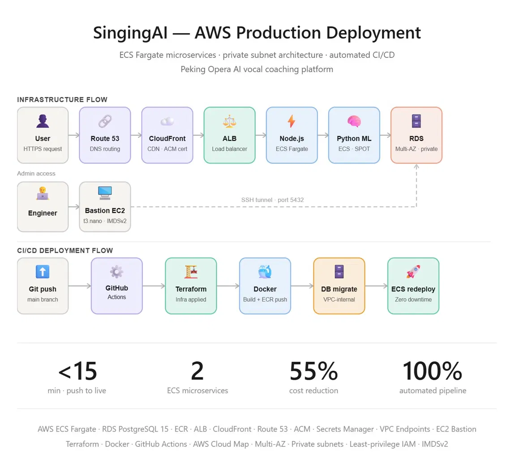
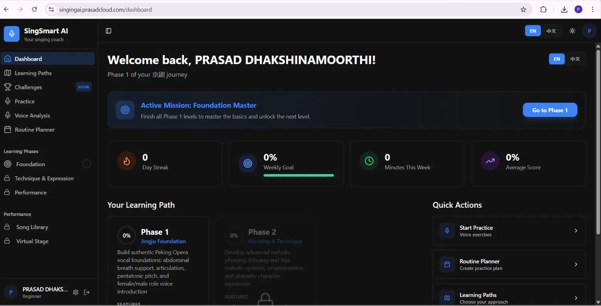
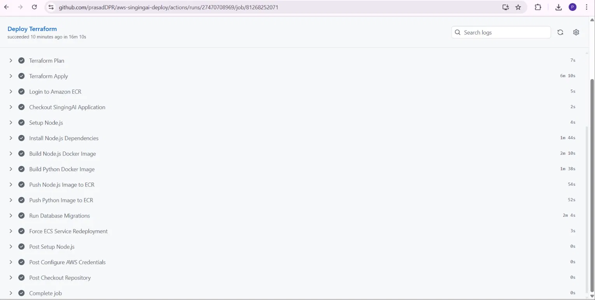
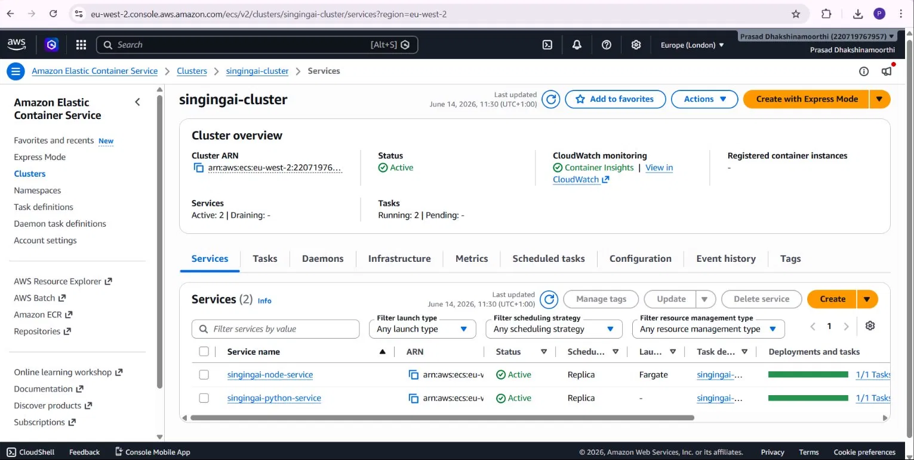

# SingingAI — AWS Production Infrastructure



> Production-grade AWS infrastructure for a Peking Opera AI vocal coaching platform — powered by CREPE pitch detection, BreathConformer CNN+Transformer, and LLaMA 3.3-70B via Groq API.

**Live:** [singingai.prasadcloud.com](https://singingai.prasadcloud.com) | **Infrastructure:** [aws-singingai-deploy](https://github.com/prasadDPR/aws-singingai-deploy)

---

## Live Application




---

## Overview

SingingAI analyses Peking Opera singing across five dimensions using deep learning models and delivers personalised AI coaching feedback:

- **Pitch Accuracy** — CREPE pitch detection model
- **Breath Control** — BreathConformer CNN+Transformer model
- **Vibrato Quality** — real-time vibrato detection
- **Tone Stability** — tone analysis and scoring
- **Expression** — Peking Opera expression evaluation
- **AI Coaching** — LLaMA 3.3-70B via Groq API with Whisper large-v3 transcription

---

## Infrastructure Components

| Service | Purpose | Configuration |
|---|---|---|
| ECS Fargate | Node.js frontend | 1 vCPU, 2GB, private subnet, 2 tasks |
| ECS Fargate | Python ML backend | 2 vCPU, 4GB, FARGATE_SPOT, 2 tasks |
| RDS PostgreSQL 15 | Application database | db.t3.micro, Multi-AZ |
| ALB | Load balancer | HTTPS only, HTTP→HTTPS redirect |
| CloudFront | CDN | Static asset caching, custom error pages |
| Route 53 | DNS | Alias record to ALB |
| ACM | SSL certificate | Wildcard *.prasadcloud.com |
| ECR | Container registry | 2 repos, lifecycle policy (last 5 images) |
| Secrets Manager | Credentials | DATABASE_URL, API keys, session secret |
| CloudWatch | Logging | 7 day retention |
| VPC Endpoints | Cost optimisation | ECR, S3, Secrets Manager, CloudWatch |
| S3 | Maintenance page | CloudFront custom error response |
| AWS Cloud Map | Service discovery | Internal routing Node.js → Python |
| EC2 Bastion | Admin access | t3.nano, IMDSv2, SSH from admin IP only |

---

## Network Design

```
VPC: 10.0.0.0/16 (eu-west-2)

Public Subnets:
  10.0.1.0/24 (eu-west-2a) — ALB, Bastion
  10.0.4.0/24 (eu-west-2b) — ALB

Private App Subnets:
  10.0.2.0/24 (eu-west-2a) — ECS Fargate
  10.0.5.0/24 (eu-west-2b) — ECS Fargate

Private DB Subnets:
  10.0.3.0/24 (eu-west-2a) — RDS PostgreSQL
  10.0.6.0/24 (eu-west-2b) — RDS PostgreSQL
```

---

## Security

- **Private subnets** — ECS and RDS not directly reachable from internet
- **Least privilege IAM** — roles scoped to specific resources only
- **Secrets Manager** — zero hardcoded credentials anywhere in codebase
- **IMDSv2** — enforced on bastion EC2 instance
- **Security groups** — ALB accepts 80/443 only, ECS accepts 3000 from ALB only, RDS accepts 5432 from ECS and bastion only
- **VPC Endpoints** — ECR, S3, Secrets Manager, CloudWatch traffic stays inside AWS private network
- **TLS 1.2+** — enforced on CloudFront and ALB
- **deletion_protection** — enabled on RDS to prevent accidental deletion

---

## CI/CD Pipeline



```
git push → main branch
    │
    ├── Terraform Init + Validate + Plan
    ├── Terraform Apply (infrastructure provisioned)
    ├── Docker build — Node.js image
    ├── Docker build — Python ML image
    ├── Push both images to ECR
    ├── Run database migrations (ECS one-off task inside VPC)
    └── Force ECS service redeployment

Total time: ~15 minutes from push to live
```

### Database Migrations

RDS is in a private subnet — not accessible from the internet. Migrations run as an ECS one-off Fargate task inside the VPC, connecting to RDS via the private network. This keeps RDS secure while fully automating schema management on every deployment.

### Maintenance Page

CloudFront custom error responses automatically serve an S3 static maintenance page when the ALB returns 502/503/504 — no DNS switching required. The URL never returns a connection error regardless of infrastructure state.

---

## AWS Infrastructure



---

## Cost Optimisation

| Optimisation | Impact |
|---|---|
| FARGATE_SPOT for Python ML service | ~70% reduction on compute |
| VPC Endpoints (ECR, S3, Secrets, CloudWatch) | ~$50/month NAT data reduction |
| ECR lifecycle policy (keep last 5 images) | Prevents storage accumulation |
| 7-day CloudWatch log retention | Reduced log storage cost |
| Auto scaling (min 2, max 4 tasks) | Scale down during low traffic |

**Identified via AWS Cost Explorer** — NAT Gateway data transfer was 60% of total bill before VPC Endpoints were added.

---

## Repository Structure

```
aws-singingai-deploy/
├── .github/
│   └── workflows/
│       ├── triggertfcloud1.yml   # Deploy pipeline
│       └── destroy.yml           # Destroy infrastructure
├── vpc.tf                        # VPC
├── subnet.tf                     # 6 subnets across 2 AZs
├── Internet gateway.tf           # Internet Gateway
├── NAT Gateway.tf                # NAT Gateway + EIP
├── route table.tf                # Route tables
├── Security Group.tf             # Security groups
├── ec2.tf                        # Bastion host
├── Load balancer.tf              # ALB + listeners
├── Target Group.tf               # Target group
├── rds.tf                        # RDS PostgreSQL
├── s3.tf                         # S3 bucket
├── cloudfront.tf                 # CloudFront distribution
├── ecr.tf                        # ECR repositories + lifecycle
├── ecs.tf                        # ECS cluster + services
├── iam-ecs.tf                    # IAM roles
├── secrets.tf                    # Secrets Manager
├── acm.tf                        # ACM certificates (eu-west-2 + us-east-1)
├── route53.tf                    # DNS records
├── vpc-endpoints.tf              # VPC Endpoints
├── static-fallback.tf            # S3 maintenance page
├── main.tf                       # Terraform config
├── provider.tf                   # AWS provider + default tags
└── variable.tf                   # Input variables
```

---

## Prerequisites

- AWS Account with appropriate permissions
- Terraform Cloud account
- GitHub repository secrets configured
- Domain registered and Route 53 hosted zone created

### Required GitHub Secrets

```
AWS_ACCESS_KEY_ID
AWS_SECRET_ACCESS_KEY
TF_API_TOKEN
TF_VAR_DB_PASSWORD
TF_VAR_MY_IP
TF_VAR_PRIVATE_KEY_PATH
TF_VAR_GROQ_API_KEY
TF_VAR_GOOGLE_CLIENT_ID
TF_VAR_GOOGLE_CLIENT_SECRET
TF_VAR_SESSION_SECRET
```

---

## Deploy

```bash
git push origin main
```

GitHub Actions handles everything automatically — Terraform, Docker, ECR push, database migrations, and ECS redeployment in a single pipeline.

## Destroy

```
GitHub → Actions → Terraform Destroy → Run workflow → type "destroy"
```

RDS deletion protection is automatically disabled before destroy. CloudFront serves the maintenance page automatically when the ALB is removed.

---

*Infrastructure managed with Terraform — provisioned in eu-west-2 (London)*